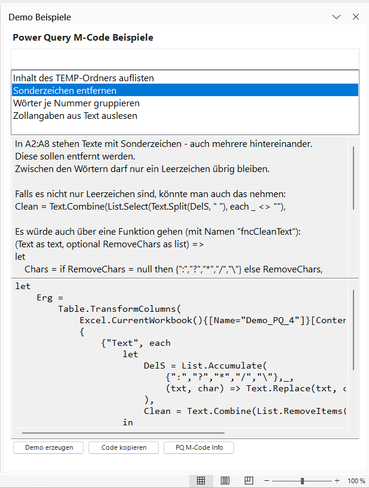

# Excel-VSTO-Toolbox

Excel VSTO Add-in mit Demobeispielen für RegEx, Power Query, VBA und Formeln.

## Download

Die aktuelle installierbare Version befindet sich unter:

[Releases](https://github.com/rstsu/Excel-VSTO-Toolbox/releases)

## Funktionen

✔ 9 RegEx-Beispiele

✔ 7 Power Query-Beispiele

✔ 5 Formel-Beispiele

✔ 5 VBA-Beispiele

## Voraussetzungen

- Excel 365 für Windows
- .NET Framework 4.8.1

Nicht unterstützt: Excel für Mac

## Installation

1. ZIP-Datei aus dem Release herunterladen

2. Inhalt in einen Ordner entpacken

3. setup.exe starten

4. Excel neu starten

5. Das Add-in erscheint im Excel-Menüband (Ribbon)

## TaskPane

Wenn der Katalog geöffnet ist, wird bei einem Klick auf "Power Query", "Regex", "VBA" oder "Formeln" der entsprechende Inhalt rechts im TaskPane angezeigt. Im TaskPane sind unten Buttons (je nachdem in welchem Bereich man ist). Bei "Power Query" sind es drei Buttons.

"Demo erzeugen" - Ein Tabellenblatt mit den Grunddaten wird erstellt.

"Code kopieren" - Der M-Code wird in die Zwischenablage kopiert.

"PQ M-Code Info" - Es wird eine Info angezeigt, die erklärt, wo der M-Code eingefügt werden muss.

Bei Klick auf die Beschreibung oben erscheint diese wieder (statt der Info).

