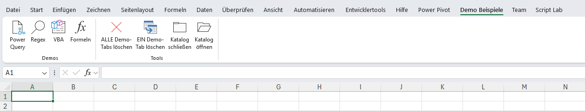

# Excel-VSTO-Toolbox
Excel VSTO Addin mit Demobeispielen für RegEx, Power Query, VBA und Formeln.

## Download
Die aktuelle installierbare Version befindet sich unter:
[Releases](https://github.com/user-attachments/files/29978054/Excel-VSTO-Toolbox-1.0.0.6.zip)
## Funktionen

✔ Power Query Beispiele

✔ RegEx Beispiele

✔ VBA Beispiele

✔ Formeln
## Voraussetzungen
Excel 365 für Windows

.NET Framework 4.8.1

## Installation
1. ZIP-Datei herunterladen

2. Inhalt in einen Ordner entpacken

3. setup.exe starten

4. Excel neu starten