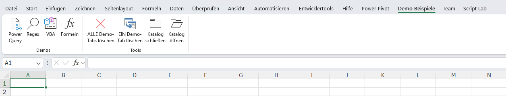
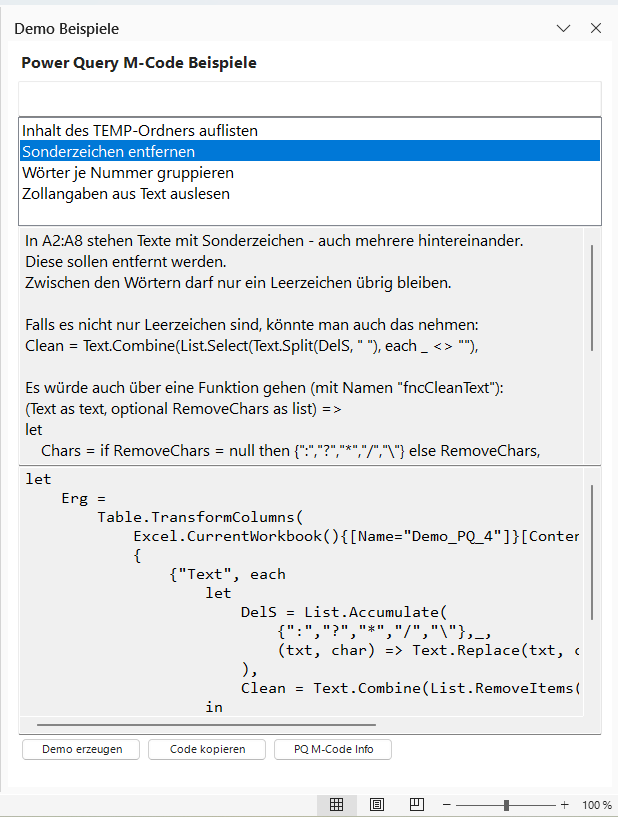

# Excel-VSTO-Toolbox

Excel VSTO Add-in mit Demobeispielen für _RegEx_, _Power Query_, _VBA_ und _Formeln_.

## Download

Die **aktuelle** installierbare Version befindet sich unter:

[Releases](https://github.com/rstsu/Excel-VSTO-Toolbox/releases)

## HINWEIS

Ab der Version **1.0.1.1** (_29.07.2026_) ist ein Zertifikat (_ExcelVSTOToolbox.cer_) mit Installationshinweisen (_Installation.txt_) dabei.

Ab der Version **1.0.2.1** (_10.08.2026_) werden auch Beispieldateien angeboten.

## Funktionen

✔ **13** RegEx-Beispiele

✔ **15** Power Query-Beispiele

✔ **6** Formel-Beispiele

✔ **6** VBA-Beispiele

## Voraussetzungen

- Excel **365** für Windows
- .NET Framework **4.8.1**

**Nicht** unterstützt: Excel für Mac

## Installation

1. **ZIP-Datei** aus dem Release **herunterladen**

2. Inhalt in einen Ordner **entpacken**

3. Installation.txt **beachten**

4. setup.exe **ausführen**

4. Excel neu **starten**

5. Das Add-in erscheint im **Excel-Menüband** (_Ribbon_)

## TaskPane

Wenn der Katalog geöffnet ist, wird bei einem Klick auf "Power Query", "Regex", "VBA" oder "Formeln" der entsprechende Inhalt rechts im TaskPane angezeigt. Im TaskPane sind unten Buttons (je nachdem in welchem Bereich man ist). Bei "Power Query" sind es drei Buttons.

"Demo erzeugen" - Ein Tabellenblatt mit den Grunddaten wird erstellt, oder eine Beispieldatei kopiert und geöffnet.

"Code kopieren" - Der M-Code wird in die Zwischenablage kopiert.

"PQ M-Code Info" - Es wird eine Info angezeigt, die erklärt, wo der M-Code eingefügt werden muss.

Bei Klick auf die Beschreibung oben erscheint diese wieder (statt der Info).

